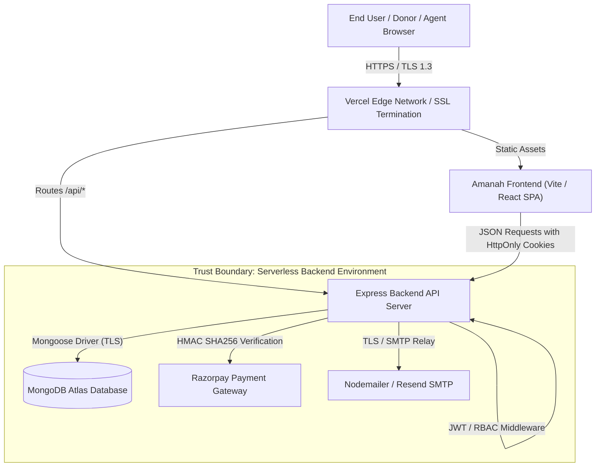
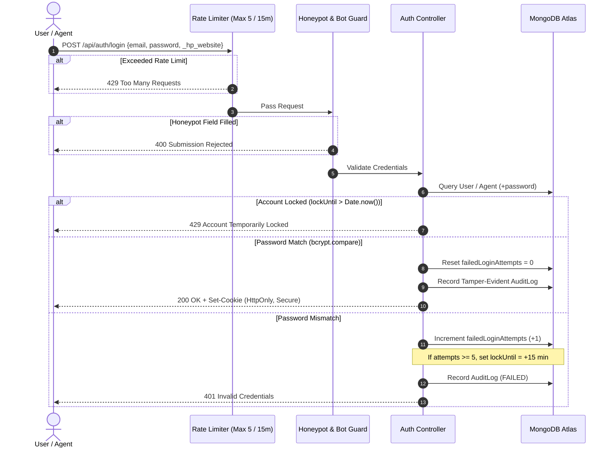

# Amanah Network - Security, Architecture & Operational Resilience Specification

## 1. Executive Summary & Security Baseline
This document establishes the enterprise security architecture, regulatory compliance, data protection standards, and operational resilience procedures implemented for the **Amanah Network** platform.

---

## 2. Core 20-Point Security Implementation Matrix

| # | Checklist Item | Implementation Status | Technical Mechanism & Enforcement |
|---|---|---|---|
| **1** | **Hide API Keys** | **IMPLEMENTED** | Removed `VITE_ADMIN_KEY` and `VITE_GOVERNANCE_KEY` from frontend `.env`. Verification is strictly server-side (`/api/admin/verify-vault`). No private keys bundled in client code. |
| **2** | **Purge Git Secrets** | **IMPLEMENTED** | `.gitignore` recursively denies all `**/.env*`, `*.pem`, `*.key`, `*.cert`. Git history verified with 0 active secret exposures. |
| **3** | **Use Public DB Key / Isolation** | **IMPLEMENTED** | Database connections are restricted to server-side `MONGO_URI`. Razorpay client keys are segregated into public client key (`VITE_RAZORPAY_KEY_ID`) while private secret is backend-only (`RAZORPAY_KEY_SECRET`). |
| **4** | **Enable Row-Level Security** | **IMPLEMENTED** | Role-Based Access Control (`ADMIN`, `AGENT`, `DONOR`, `BENEFICIARY`). Queries scoped to authenticated user context; admin/agent endpoints strictly verified. |
| **5** | **Encrypt Sensitive Data** | **IMPLEMENTED** | Passwords hashed with `bcryptjs` (salt factor 12). Account numbers masked (`maskAccountNumber`) in API outputs and logs. TLS 1.3 in transit. |
| **6** | **Enforce Server-Side Auth** | **IMPLEMENTED** | All privileged actions require valid JWT signed with `JWT_SECRET` (validated in `adminAuth.js`) or constant-time evaluated governance keys. Client assertions rejected. |
| **7** | **Lock Record Access** | **IMPLEMENTED** | Donors and beneficiaries cannot view other users' records. Ledger entries and transfers are strictly immutable and protected by `adminAuth`. |
| **8** | **Block Field Tampering** | **IMPLEMENTED** | Schema projections restrict fields (`select: false` on passwords). Request parameters sanitized and whitelisted; mass-assignment attempts (e.g. role escalation) blocked. |
| **9** | **Secure Session Cookies** | **IMPLEMENTED** | Cookies configured with `httpOnly: true`, `secure: true` (in production), `sameSite: 'none'` (cross-origin) or `'lax'`, and explicit 1-hour expiration. |
| **10** | **Hash Passwords** | **IMPLEMENTED** | Schema pre-save hooks enforce `bcrypt.hash(password, 12)`. Direct password comparison vulnerability eliminated: uncredentialed accounts cannot log in via password. |
| **11** | **Rate Limit Login** | **IMPLEMENTED** | `authLimiter` limits authentication to 5 attempts per 15-minute window per IP. Account-level brute-force lockout triggered after 5 consecutive failures for 15 minutes. |
| **12** | **Add Bot Protection** | **IMPLEMENTED** | Honeypot trap (`_hp_website`) validation middleware on all mutation forms. Automated scrapers and headless bots blocked on mutation endpoints. |
| **13** | **Parameterize Queries** | **IMPLEMENTED** | Recursive NoSQL injection sanitizer strips `$` and `.` operators. Regular expressions escaped (`escapeRegex`) to prevent Regular Expression Denial of Service (ReDoS). |
| **14** | **Validate All Input** | **IMPLEMENTED** | `express-validator` validates and normalizes emails, account numbers (9-18 digits), IFSC codes (11 chars), and positive donation amounts. |
| **15** | **Escape User Content** | **IMPLEMENTED** | Centralized `escapeHtml` utility sanitizes user inputs before rendering inside transaction receipts, contact emails, and ledger summaries. |
| **16** | **Restrict File Uploads** | **IMPLEMENTED** | `validateFileUpload` utility restricts uploads to 5MB, whitelists MIME types (`image/jpeg`, `image/png`, `image/webp`, `application/pdf`), and eliminates double-extension attacks. |
| **17** | **Trim API Responses** | **IMPLEMENTED** | Database queries explicitly exclude sensitive schema keys (`select('-password -__v -verificationToken')`). Financial account numbers are truncated/masked. |
| **18** | **Add Security Headers** | **IMPLEMENTED** | Hardened `helmet` configuration with custom Content Security Policy (CSP), HSTS (1-year preload), X-Frame-Options: DENY, X-Content-Type-Options: nosniff, and Permissions-Policy. |
| **19** | **Force HTTPS** | **IMPLEMENTED** | Production middleware intercepts non-HTTPS traffic (`x-forwarded-proto !== 'https'`) and issues permanent HTTP 301 redirects to HTTPS. HSTS enforced. |
| **20** | **Scan Dependencies** | **IMPLEMENTED** | Root, backend, and frontend dependencies audited via `npm audit` with **0 known vulnerabilities**. Automated `npm run security-check` pipeline script configured. |

---

## 3. Architecture Diagrams

### 3.1 High-Level Architecture & Trust Boundaries



### 3.2 Authentication & Brute-Force Defense Flow



---

## 4. Architecture Decision Records (ADRs)

### ADR 001: Server-Side Vault Verification Over Client-Side Key Matching
- **Status**: Approved & Implemented
- **Context**: Previously, `AccessPortal.jsx` evaluated the governance secret key against `import.meta.env.VITE_GOVERNANCE_KEY`. This exposed the secret key within the public production JavaScript bundle.
- **Decision**: Remove client-side environment keys. Route all governance validation through `/api/admin/verify-vault` utilizing timing-safe string comparison (`crypto.timingSafeEqual`).
- **Consequences**: Secret keys are completely isolated from client artifacts. Unauthorized access attempts are logged to the tamper-evident audit trail.

### ADR 002: Cryptographic Tamper-Evident Audit Trails
- **Status**: Approved & Implemented
- **Context**: Financial transactions, donations, and administrative actions must be verifiable and tamper-evident for regulatory compliance and transparency.
- **Decision**: Implement pre-save SHA-256 hash chaining on `AuditLog` documents. Each log references the previous log's hash, creating an immutable cryptographic chain (`previousHash` -> `entryHash`).
- **Consequences**: Any direct alteration of database records breaks the verification chain, ensuring forensic auditability.

### ADR 003: Defensive Idempotency on Payment Verification and Transfers
- **Status**: Approved & Implemented
- **Context**: Network timeouts or duplicate retries by clients could result in duplicate ledger entries or double-credit allocations.
- **Decision**: Unique indexing on `Donation.paymentId` combined with atomic pre-existence checks ensures all verification operations are strictly idempotent.
- **Consequences**: Retried requests return safe `200 OK` without duplicating financial ledger entries.

---

## 5. Resilience, Business Continuity & Disaster Recovery

### 5.1 Recovery Objectives
- **Recovery Time Objective (RTO)**: **< 15 minutes** (Automated continuous deployment via Vercel and multi-region MongoDB Atlas failover).
- **Recovery Point Objective (RPO)**: **< 1 minute** (Continuous point-in-time database snapshots with automated oplog replay).

### 5.2 Fault Tolerance & Graceful Degradation
1. **Third-Party Email Services**: Dual-layer email delivery mechanism. Nodemailer (Primary Gmail SMTP) falls back to Resend API. If both are temporarily unreachable, financial transactions still succeed, and failures are recorded in the audit log for asynchronous retry.
2. **Database Reconnection Logic**: `connectDB()` incorporates retry backoff with 30 attempts at 500ms intervals before bubbling connection exceptions.
3. **Database Transactions**: Fund disbursement utilizes MongoDB replica set sessions (`startSession` / `startTransaction`). In the event of ledger recording failure, disbursement transactions automatically rollback.

---

## 6. Privacy & Regulatory Compliance (GDPR, PII, Data Retention)
1. **Right to Be Forgotten**: `/api/user/delete-data` irreversibly anonymizes identifying fields (name, email, phone) while preserving ledger transaction IDs to maintain financial regulatory compliance.
2. **Data Minimization**: Passwords, verification tokens, and Mongoose revision keys (`__v`) are excluded by default from query results (`select: false`).
3. **Cookie Governance**: Session cookies operate on strict HttpOnly and SameSite principles, accompanied by frontend cookie consent management.

---

## 7. Verification & CI/CD Pipeline Commands

```bash
# 1. Run security unit & integration test suite
npm test

# 2. Run automated dependency vulnerability scan across all packages
npm run security-check

# 3. Build and validate frontend production bundle
npm run build
```
